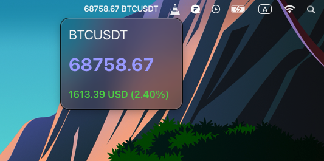

# BTCUSDT realtime price fetching desktop app using Tauri framework



A lightweight macOS menubar desktop application that fetches and displays the real-time BTCUSDT price from the Binance public API. Built with [Tauri v2](https://v2.tauri.app/), React 19, and TypeScript.

---

## Features

- Live BTCUSDT price fetched from the [Binance Vision API](https://data-api.binance.vision/api/v3/ticker?symbol=BTCUSDT) every 2 seconds
- Price and symbol reflected in the system tray icon title in real time
- Transparent, frameless, always-on-top window with macOS vibrancy (HudWindow blur effect)
- Window anchors below the tray icon (TrayBottomCenter positioning)
- Window auto-hides when it loses focus
- Tray left-click toggles window visibility; right-click menu includes a Quit option

---

## Tech Stack

| Layer            | Technology                               |
| ---------------- | ---------------------------------------- |
| Desktop runtime  | [Tauri v2](https://v2.tauri.app/) (Rust) |
| Frontend         | React 19 + TypeScript                    |
| Bundler          | Vite                                     |
| Data fetching    | TanStack React Query v5                  |
| Tray positioning | tauri-plugin-positioner                  |
| Window vibrancy  | window-vibrancy 0.7                      |

---

## Project Structure

```
T2026Balance/
├── src/                        # React frontend
│   ├── App.tsx                 # Root component — React Query data fetch + tray title sync
│   ├── view/
│   │   └── Main.tsx            # UI — price display
│   ├── types/
│   │   └── index.ts            # IDate interface
│   └── utils/
│       └── index.ts            # Helpers (truncate decimals, price colour)
└── src-tauri/                  # Rust/Tauri backend
    ├── src/
    │   ├── lib.rs              # App setup: vibrancy, tray icon, window events
    │   └── main.rs             # Entry point
    ├── Cargo.toml              # Rust dependencies
    └── tauri.conf.json         # Window and bundle config
```

---

## How It Works

### Backend (`lib.rs`)

- On startup the main window is hidden and a tray icon is registered.
- **Left-click** on the tray icon shows/hides the window, positioned directly below the tray (`TrayBottomCenter`).
- **macOS vibrancy** (`HudWindow` material, 14 pt corner radius) is applied via `window-vibrancy`.
- A `WindowEvent::Focused` handler auto-hides the window when it loses focus.
- A **Quit** menu item is available via right-click to exit the app.

### Frontend (`App.tsx`)

- `useQuery` polls the Binance public ticker endpoint every **2 seconds** (including when the window is in the background via `refetchIntervalInBackground: true`).
- On each successful response, the tray icon title is updated to show the live price and symbol (e.g. `43521.00 BTCUSDT`).
- `Main.tsx` renders the symbol, last price, price change in USD, and percentage change with colour coding (green / red / neutral).

### Data Interface

```ts
export interface IDate {
  symbol: string;
  priceChange: string;
  priceChangePercent: string;
  lastPrice: string;
}
```

---

## Prerequisites

- [Node.js](https://nodejs.org/) >= 18
- [Rust](https://www.rust-lang.org/tools/install) (stable toolchain)
- [Tauri CLI v2](https://v2.tauri.app/start/prerequisites/)
- Yarn (used as the package manager)

---

## Getting Started

```bash
# Install frontend dependencies
yarn install

# Start in development mode (hot-reload)
yarn tauri dev

# Build for production
yarn tauri build
```

---

## Window Configuration

Defined in `src-tauri/tauri.conf.json`:

| Property        | Value                           |
| --------------- | ------------------------------- |
| Size            | 200 × 150 px                    |
| Decorations     | Disabled                        |
| Always on top   | Yes                             |
| Transparent     | Yes                             |
| Resizable       | No                              |
| macOSPrivateApi | Enabled (required for vibrancy) |

---

## Tauri Official Documentation

Refer to the official Tauri v2 documentation for framework details, plugin APIs, and build guides:

**[https://v2.tauri.app/](https://v2.tauri.app/)**

---

## Recommended IDE Setup

- [VS Code](https://code.visualstudio.com/)
- [Tauri VS Code Extension](https://marketplace.visualstudio.com/items?itemName=tauri-apps.tauri-vscode)
- [rust-analyzer](https://marketplace.visualstudio.com/items?itemName=rust-lang.rust-analyzer)
